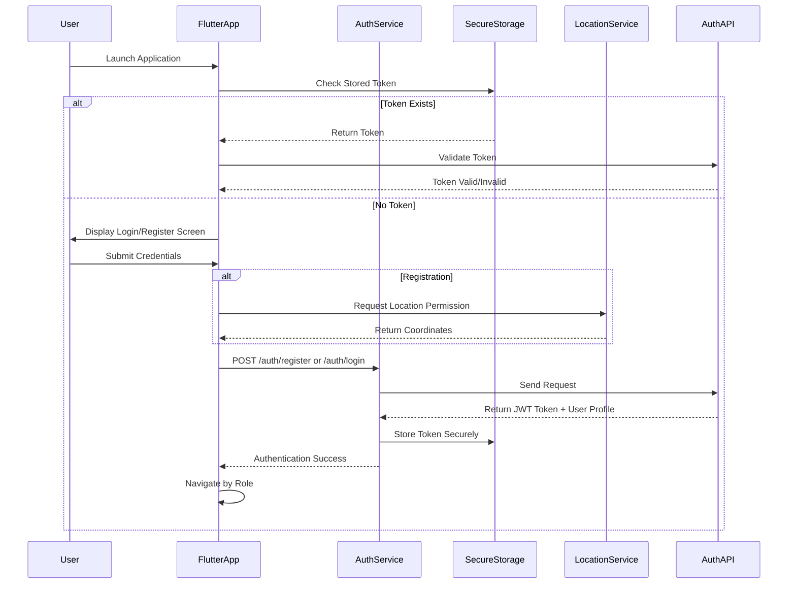

# OnMint Healthcare Platform - Design Document

## Overview

The OnMint Healthcare Platform is a comprehensive Flutter-based healthcare ecosystem designed to connect patients with healthcare service providers through three specialized mobile applications. The platform implements a multi-tenant architecture with role-based access control, supporting various healthcare services including medical consultations, pharmacy services, nursing care, laboratory tests, ambulance services, and blood bank management.

### System Architecture

The platform follows a microservices-inspired architecture with three distinct Flutter applications sharing common packages and a centralized backend API. Each application is optimized for mobile devices and implements a consistent light blue Material Design theme for brand coherence.

**Core Components:**
- **Admin App**: Flutter administrative interface for platform management
- **Vendor App**: Flutter service provider interface for healthcare professionals
- **User App**: Flutter patient interface for accessing healthcare services
- **Shared Flutter Packages**: Common functionality across applications
- **Backend API**: Centralized REST API serving all applications
- **Authentication Service**: JWT-based authentication with role-based routing
- **Location Service**: Flutter Geolocator integration for service matching

### Technology Stack

**Frontend:**
- Flutter (Dart) framework
- Material Design with custom light blue theme
- Mobile-first responsive design
- Three separate Flutter projects running on localhost:3000
- Flutter HTTP package for API integration
- Flutter secure storage for JWT tokens
- Geolocator package for location services

**Backend:**
- REST API architecture
- JWT token-based authentication
- Base URL: http://localhost:5000/api/v1

**Security:**
- Role-based access control (RBAC)
- Input validation and sanitization
- Rate limiting for authentication endpoints
- Flutter secure storage for token management

## Architecture

### Application Structure

The platform implements a modular Flutter architecture with three separate Flutter projects sharing common packages and utilities:

```
onmint-platform/
├── admin_app/ (Flutter project)
│   ├── lib/
│   │   ├── main.dart
│   │   ├── screens/
│   │   ├── widgets/
│   │   └── services/
│   ├── pubspec.yaml
│   └── android/ios/
├── vendor_app/ (Flutter project)
│   ├── lib/
│   │   ├── main.dart
│   │   ├── screens/
│   │   ├── widgets/
│   │   └── services/
│   ├── pubspec.yaml
│   └── android/ios/
├── user_app/ (Flutter project)
│   ├── lib/
│   │   ├── main.dart
│   │   ├── screens/
│   │   ├── widgets/
│   │   └── services/
│   ├── pubspec.yaml
│   └── android/ios/
└── shared_packages/
    ├── auth_service/
    │   ├── lib/
    │   └── pubspec.yaml
    ├── api_client/
    │   ├── lib/
    │   └── pubspec.yaml
    ├── location_service/
    │   ├── lib/
    │   └── pubspec.yaml
    └── ui_components/
        ├── lib/
        └── pubspec.yaml
```

### Flutter State Management

The platform uses Provider pattern for state management across all applications:

**Authentication State:**
- `AuthProvider`: Manages login/logout state and user profile
- `TokenProvider`: Handles JWT token storage and validation
- `RoleProvider`: Manages role-based access control

**Application State:**
- `NavigationProvider`: Manages app navigation state
- `ThemeProvider`: Handles light blue Material Design theme
- `LocationProvider`: Manages geolocation state and permissions

### Authentication Flow



### Role-Based Navigation

The platform implements Flutter Navigator 2.0 with role-based routing:

- **Patient Role** → User App (MaterialApp with patient-specific routes)
- **Vendor Roles** (doctor, pharmacist, nurse, ambulance, bloodbank, pathology) → Vendor App (MaterialApp with vendor-specific routes)
- **Admin Role** → Admin App (MaterialApp with admin-specific routes)

### Flutter Package Dependencies

**Core Dependencies:**
```yaml
dependencies:
  flutter:
    sdk: flutter
  http: ^1.1.0                    # API communication
  flutter_secure_storage: ^9.0.0  # Secure token storage
  provider: ^6.0.5                # State management
  geolocator: ^10.1.0            # Location services
  permission_handler: ^11.0.1     # Location permissions
  shared_preferences: ^2.2.2      # App preferences
  connectivity_plus: ^5.0.1       # Network connectivity
```

**UI Dependencies:**
```yaml
  material_design_icons_flutter: ^7.0.7296
  flutter_spinkit: ^5.2.0        # Loading indicators
  fluttertoast: ^8.2.4          # Toast messages
  cached_network_image: ^3.3.0   # Image caching
```

## Components and Interfaces

### Shared Flutter Packages

**Auth Service Package (`auth_service`)**
- JWT token management with flutter_secure_storage
- Authentication state management with Provider
- Role-based access validation
- Automatic token refresh handling

**API Client Package (`api_client`)**
- HTTP client with base URL configuration
- Request/response interceptors for authentication
- Error handling and retry mechanisms
- Network connectivity monitoring

**Location Service Package (`location_service`)**
- Geolocator integration for coordinate detection
- Location permission handling
- GeoJSON Point format conversion
- Manual location entry fallback

**UI Components Package (`ui_components`)**
- Custom Material Design widgets with light blue theme
- Reusable form components with validation
- Loading indicators and progress widgets
- Error display and toast notifications

### Application-Specific Flutter Widgets

**Admin App Widgets:**
- `UserManagementScreen`: User management interface
- `VendorApprovalWidget`: Vendor approval workflows
- `SystemDashboard`: Platform monitoring dashboard
- `AnalyticsChart`: Platform analytics visualization

**Vendor App Widgets:**
- `ServiceManagementScreen`: Service management interface
- `AppointmentScheduler`: Appointment scheduling system
- `ProfileForm`: Vendor profile management
- `RevenueTracker`: Revenue tracking dashboard

**User App Widgets:**
- `ServiceDiscoveryScreen`: Healthcare service discovery
- `AppointmentBooking`: Appointment booking system
- `HealthRecords`: Health record management
- `ProviderSearch`: Service provider search interface

### Flutter Interface Specifications

**Authentication Service Interface:**
```dart
// Registration Request Model
class RegistrationRequest {
  final String email;
  final String password;
  final String firstName;
  final String lastName;
  final String phone;
  final String city;
  final String state;
  final String pincode;
  final String role;
  final LocationPoint location;
  
  // Vendor-specific fields
  final String? specialization;
  final String? qualifications;
  final int? experience;
  final double? consultationFee;
  final String? licenseNumber;
  final List<String>? languages;
}

// Authentication Response Model
class AuthResponse {
  final bool success;
  final String token;
  final UserProfile user;
  final String? error;
}

// User Profile Model
class UserProfile {
  final String id;
  final String email;
  final String role;
  final String firstName;
  final String lastName;
  final Map<String, dynamic> profile;
}
```

**Location Service Interface:**
```dart
// Location Point Model
class LocationPoint {
  final String type = "Point";
  final List<double> coordinates; // [longitude, latitude]
  
  LocationPoint({required this.coordinates});
}

// Location Service Methods
abstract class LocationService {
  Future<LocationPoint?> getCurrentLocation();
  Future<bool> requestLocationPermission();
  Future<LocationPoint> validateCoordinates(double lat, double lng);
}
```

**API Client Interface:**
```dart
// API Client Configuration
class ApiConfig {
  static const String baseUrl = 'http://localhost:5000/api/v1';
  static const Duration timeout = Duration(seconds: 30);
  static const Map<String, String> headers = {
    'Content-Type': 'application/json',
  };
}

// HTTP Service Methods
abstract class ApiClient {
  Future<ApiResponse<T>> post<T>(String endpoint, Map<String, dynamic> data);
  Future<ApiResponse<T>> get<T>(String endpoint);
  Future<ApiResponse<T>> put<T>(String endpoint, Map<String, dynamic> data);
  Future<ApiResponse<T>> delete<T>(String endpoint);
}
```

## Data Models

### Flutter Data Models

**User Model (Dart):**
```dart
class User {
  final String id;
  final String email;
  final String firstName;
  final String lastName;
  final String phone;
  final String city;
  final String state;
  final String pincode;
  final String role;
  final LocationPoint location;
  final DateTime createdAt;
  final bool isActive;
  
  // Vendor-specific fields
  final String? specialization;
  final String? qualifications;
  final int? experience;
  final double? consultationFee;
  final String? licenseNumber;
  final List<String>? languages;
  final bool? isVerified;
  
  User({
    required this.id,
    required this.email,
    required this.firstName,
    required this.lastName,
    required this.phone,
    required this.city,
    required this.state,
    required this.pincode,
    required this.role,
    required this.location,
    required this.createdAt,
    required this.isActive,
    this.specialization,
    this.qualifications,
    this.experience,
    this.consultationFee,
    this.licenseNumber,
    this.languages,
    this.isVerified,
  });
  
  factory User.fromJson(Map<String, dynamic> json) {
    return User(
      id: json['id'],
      email: json['email'],
      firstName: json['firstName'],
      lastName: json['lastName'],
      phone: json['phone'],
      city: json['city'],
      state: json['state'],
      pincode: json['pincode'],
      role: json['role'],
      location: LocationPoint.fromJson(json['location']),
      createdAt: DateTime.parse(json['createdAt']),
      isActive: json['isActive'],
      specialization: json['specialization'],
      qualifications: json['qualifications'],
      experience: json['experience'],
      consultationFee: json['consultationFee']?.toDouble(),
      licenseNumber: json['licenseNumber'],
      languages: json['languages']?.cast<String>(),
      isVerified: json['isVerified'],
    );
  }
  
  Map<String, dynamic> toJson() {
    return {
      'id': id,
      'email': email,
      'firstName': firstName,
      'lastName': lastName,
      'phone': phone,
      'city': city,
      'state': state,
      'pincode': pincode,
      'role': role,
      'location': location.toJson(),
      'createdAt': createdAt.toIso8601String(),
      'isActive': isActive,
      if (specialization != null) 'specialization': specialization,
      if (qualifications != null) 'qualifications': qualifications,
      if (experience != null) 'experience': experience,
      if (consultationFee != null) 'consultationFee': consultationFee,
      if (licenseNumber != null) 'licenseNumber': licenseNumber,
      if (languages != null) 'languages': languages,
      if (isVerified != null) 'isVerified': isVerified,
    };
  }
}
```

**Location Model (Dart):**
```dart
class LocationPoint {
  final String type = "Point";
  final List<double> coordinates; // [longitude, latitude]
  
  LocationPoint({required this.coordinates});
  
  factory LocationPoint.fromJson(Map<String, dynamic> json) {
    return LocationPoint(
      coordinates: List<double>.from(json['coordinates']),
    );
  }
  
  Map<String, dynamic> toJson() {
    return {
      'type': type,
      'coordinates': coordinates,
    };
  }
  
  double get longitude => coordinates[0];
  double get latitude => coordinates[1];
}
```

**Authentication Token Model (Dart):**
```dart
class AuthToken {
  final String token;
  final DateTime expiresAt;
  final String userId;
  final String role;
  
  AuthToken({
    required this.token,
    required this.expiresAt,
    required this.userId,
    required this.role,
  });
  
  bool get isExpired => DateTime.now().isAfter(expiresAt);
  
  factory AuthToken.fromJson(Map<String, dynamic> json) {
    return AuthToken(
      token: json['token'],
      expiresAt: DateTime.parse(json['expiresAt']),
      userId: json['userId'],
      role: json['role'],
    );
  }
  
  Map<String, dynamic> toJson() {
    return {
      'token': token,
      'expiresAt': expiresAt.toIso8601String(),
      'userId': userId,
      'role': role,
    };
  }
}
```

**Service Model (Dart):**
```dart
class Service {
  final String id;
  final String vendorId;
  final String serviceType;
  final String name;
  final String description;
  final Map<String, dynamic> availability;
  final Map<String, dynamic> pricing;
  final LocationPoint location;
  
  Service({
    required this.id,
    required this.vendorId,
    required this.serviceType,
    required this.name,
    required this.description,
    required this.availability,
    required this.pricing,
    required this.location,
  });
  
  factory Service.fromJson(Map<String, dynamic> json) {
    return Service(
      id: json['id'],
      vendorId: json['vendorId'],
      serviceType: json['serviceType'],
      name: json['name'],
      description: json['description'],
      availability: json['availability'],
      pricing: json['pricing'],
      location: LocationPoint.fromJson(json['location']),
    );
  }
  
  Map<String, dynamic> toJson() {
    return {
      'id': id,
      'vendorId': vendorId,
      'serviceType': serviceType,
      'name': name,
      'description': description,
      'availability': availability,
      'pricing': pricing,
      'location': location.toJson(),
    };
  }
}
```

## Correctness Properties

*A property is a characteristic or behavior that should hold true across all valid executions of a system-essentially, a formal statement about what the system should do. Properties serve as the bridge between human-readable specifications and machine-verifiable correctness guarantees.*

### Property 1: Role-Based Access Control

*For any* user with a specific role (patient, vendor, admin), the system should only grant access to the application designated for that role and deny access to all other applications.

**Validates: Requirements 1.2, 1.3, 1.4, 3.4, 3.5**

### Property 2: Role-Based Routing

*For any* authenticated user, the system should redirect them to the correct application home page based on their role (patient → User_App, vendor roles → Vendor_App, admin → Admin_App).

**Validates: Requirements 3.1, 3.2, 3.3**

### Property 3: Registration Field Validation

*For any* user registration attempt, the system should validate that all required fields for the user's role are present and properly formatted before allowing registration to proceed.

**Validates: Requirements 2.3, 2.4, 2.5**

### Property 4: Vendor-Specific Registration

*For any* vendor role (doctor, pharmacist, nurse, ambulance, bloodbank, pathology), the system should accept registration with role-specific professional fields and validate credentials appropriately.

**Validates: Requirements 6.7**

### Property 5: Authentication Response Format

*For any* successful authentication operation (registration or login), the system should return a response containing valid JWT tokens and appropriate user profile information.

**Validates: Requirements 2.6, 2.7**

### Property 6: Service Type Support

*For any* supported healthcare service type (doctor, pharmacy, nursing, pathology, ambulance, bloodbank), vendors should be able to register and offer services of that type on the platform.

**Validates: Requirements 4.7**

### Property 7: Location Data Format

*For any* user registration with location data, the system should store and validate location information in GeoJSON Point format with proper longitude and latitude coordinates.

**Validates: Requirements 5.2, 5.4, 5.5**

### Property 8: Location Service Fallback

*For any* location detection failure during registration, the system should provide a manual location entry option and validate the manually entered coordinates.

**Validates: Requirements 5.3**

### Property 9: API Configuration Consistency

*For any* API endpoint configuration change, all three applications should consistently use the updated configuration without requiring individual updates.

**Validates: Requirements 7.3, 7.5**

### Property 10: Responsive Design Adaptation

*For any* mobile device viewport, the user interface should adapt appropriately to mobile application dimensions while maintaining functionality.

**Validates: Requirements 8.2**

### Property 11: Theme Consistency

*For any* visual element across all three applications, the light blue theme and consistent branding should be maintained uniformly.

**Validates: Requirements 8.4, 9.2, 9.3**

### Property 12: Accessibility Compliance

*For any* color combination used in the interface, the contrast ratio should meet accessibility requirements for readable text and interactive elements.

**Validates: Requirements 9.5**

### Property 13: Navigation State Indication

*For any* page navigation within an application, the system should provide clear visual indicators showing the current page and navigation state.

**Validates: Requirements 10.4, 10.5**

### Property 14: Input Validation and Sanitization

*For any* user input field (email, password, phone, pincode), the system should validate format requirements and sanitize inputs to prevent security vulnerabilities.

**Validates: Requirements 11.1, 11.2, 11.3, 11.4, 11.5**

### Property 15: Rate Limiting Protection

*For any* authentication endpoint (registration, login), the system should implement rate limiting to prevent abuse and excessive requests from the same source.

**Validates: Requirements 11.6**

### Property 16: Error Message Specificity

*For any* validation failure during registration, the system should return specific error messages that identify the exact validation issue without revealing sensitive system information.

**Validates: Requirements 12.1, 12.2**

### Property 17: User Feedback During Operations

*For any* API operation (registration, login, data submission), the system should provide appropriate loading indicators during processing and success/error feedback upon completion.

**Validates: Requirements 12.3, 12.4, 12.5**

## Error Handling

### Flutter Authentication Errors

**Registration Failures:**
- Invalid email format or duplicate email addresses
- Password complexity requirements not met
- Missing required fields for specific user roles
- Invalid location coordinates or format
- Professional credential validation failures for vendors

**Login Failures:**
- Invalid credentials (generic error message for security)
- Account not found or inactive
- Rate limiting exceeded

**Flutter Error Response Handling:**
```dart
class ApiError {
  final bool success;
  final String code;
  final String message;
  final String? field; // For field-specific validation errors
  
  ApiError({
    required this.success,
    required this.code,
    required this.message,
    this.field,
  });
  
  factory ApiError.fromJson(Map<String, dynamic> json) {
    return ApiError(
      success: json['success'] ?? false,
      code: json['error']['code'],
      message: json['error']['message'],
      field: json['error']['field'],
    );
  }
}
```

### Flutter Network and API Errors

**Connection Issues:**
- Network timeout handling with retry mechanisms using connectivity_plus
- API server unavailability with fallback messaging
- Partial data loading with progressive enhancement

**Data Validation Errors:**
- Client-side validation with immediate feedback using Flutter form validators
- Server-side validation with detailed error responses
- Input sanitization with security error logging

**Flutter Error Handling Implementation:**
```dart
class ErrorHandler {
  static void handleApiError(BuildContext context, ApiError error) {
    switch (error.code) {
      case 'VALIDATION_ERROR':
        _showValidationError(context, error.message, error.field);
        break;
      case 'NETWORK_ERROR':
        _showNetworkError(context);
        break;
      case 'AUTH_ERROR':
        _handleAuthError(context, error.message);
        break;
      default:
        _showGenericError(context, error.message);
    }
  }
  
  static void _showValidationError(BuildContext context, String message, String? field) {
    ScaffoldMessenger.of(context).showSnackBar(
      SnackBar(
        content: Text(message),
        backgroundColor: Colors.red,
        action: SnackBarAction(
          label: 'Dismiss',
          onPressed: () {},
        ),
      ),
    );
  }
  
  static void _showNetworkError(BuildContext context) {
    showDialog(
      context: context,
      builder: (context) => AlertDialog(
        title: Text('Network Error'),
        content: Text('Please check your internet connection and try again.'),
        actions: [
          TextButton(
            onPressed: () => Navigator.of(context).pop(),
            child: Text('OK'),
          ),
        ],
      ),
    );
  }
}
```

### Flutter User Experience Error Handling

**Loading States:**
- Flutter CircularProgressIndicator during data fetching
- Shimmer effects for skeleton screens using shimmer package
- Progress indicators for multi-step processes using LinearProgressIndicator
- Timeout handling with user-friendly messages

**Recovery Mechanisms:**
- Retry buttons for failed operations using ElevatedButton
- Form data preservation during errors using Flutter form state
- Graceful degradation for non-critical features

**Flutter Loading and Error Widgets:**
```dart
class LoadingWidget extends StatelessWidget {
  final String message;
  
  const LoadingWidget({Key? key, this.message = 'Loading...'}) : super(key: key);
  
  @override
  Widget build(BuildContext context) {
    return Center(
      child: Column(
        mainAxisAlignment: MainAxisAlignment.center,
        children: [
          CircularProgressIndicator(
            valueColor: AlwaysStoppedAnimation<Color>(
              Theme.of(context).primaryColor,
            ),
          ),
          SizedBox(height: 16),
          Text(
            message,
            style: Theme.of(context).textTheme.bodyMedium,
          ),
        ],
      ),
    );
  }
}

class ErrorWidget extends StatelessWidget {
  final String message;
  final VoidCallback? onRetry;
  
  const ErrorWidget({Key? key, required this.message, this.onRetry}) : super(key: key);
  
  @override
  Widget build(BuildContext context) {
    return Center(
      child: Column(
        mainAxisAlignment: MainAxisAlignment.center,
        children: [
          Icon(
            Icons.error_outline,
            size: 64,
            color: Colors.red,
          ),
          SizedBox(height: 16),
          Text(
            message,
            textAlign: TextAlign.center,
            style: Theme.of(context).textTheme.bodyLarge,
          ),
          if (onRetry != null) ...[
            SizedBox(height: 16),
            ElevatedButton(
              onPressed: onRetry,
              child: Text('Retry'),
            ),
          ],
        ],
      ),
    );
  }
}
```

## Testing Strategy

### Dual Testing Approach

The OnMint Healthcare Platform will implement comprehensive testing using both unit tests and property-based tests to ensure system reliability and correctness across all Flutter applications.

**Unit Testing Focus:**
- Specific authentication scenarios and edge cases
- Individual Flutter widget functionality verification
- Integration points between applications and shared packages
- Error condition handling and recovery mechanisms
- User interface interaction validation with Flutter widget tests

**Property-Based Testing Focus:**
- Universal properties across all user roles and inputs
- Authentication and authorization behavior validation
- Data format and validation rule verification
- Cross-application consistency checks
- Security and input sanitization verification

### Flutter Testing Configuration

**Testing Framework:** 
- `flutter_test` for unit and widget tests
- `integration_test` for end-to-end testing
- `check` package for property-based testing in Dart

**Test Configuration:**
```yaml
dev_dependencies:
  flutter_test:
    sdk: flutter
  integration_test:
    sdk: flutter
  mockito: ^5.4.2
  build_runner: ^2.4.7
  check: ^0.2.1  # Property-based testing
  fake_async: ^1.3.1
  flutter_driver:
    sdk: flutter
```

**Property-Based Test Configuration:**
- Minimum 100 iterations per property test
- Custom generators for user roles, registration data, and location coordinates
- Shrinking enabled for minimal failing examples

**Property Test Tags:**
Each property-based test will include a comment tag referencing the design document property:

```dart
// Feature: onmint-healthcare-platform, Property 1: Role-Based Access Control
// Feature: onmint-healthcare-platform, Property 2: Role-Based Routing
```

### Flutter Test Coverage Areas

**Authentication System Testing:**
```dart
// Example Flutter widget test
testWidgets('Login form validates email format', (WidgetTester tester) async {
  await tester.pumpWidget(MaterialApp(home: LoginScreen()));
  
  await tester.enterText(find.byKey(Key('email_field')), 'invalid-email');
  await tester.tap(find.byKey(Key('login_button')));
  await tester.pump();
  
  expect(find.text('Please enter a valid email'), findsOneWidget);
});

// Example property-based test
void main() {
  group('Authentication Properties', () {
    test('Property 1: Role-based access control', () {
      // Feature: onmint-healthcare-platform, Property 1: Role-Based Access Control
      check(any.of(['patient', 'doctor', 'admin'])).times(100).that((role) {
        final user = User(role: role, /* other fields */);
        final allowedApp = RoleBasedRouter.getAllowedApp(user);
        
        switch (role) {
          case 'patient':
            return allowedApp == 'user_app';
          case 'doctor':
            return allowedApp == 'vendor_app';
          case 'admin':
            return allowedApp == 'admin_app';
          default:
            return false;
        }
      });
    });
  });
}
```

**Flutter Widget Testing:**
- Registration flow validation for all user roles using `testWidgets`
- Login process verification with role-based routing
- Token generation and validation with mock services
- Session management and expiration handling

**Flutter Integration Testing:**
- Role-based application access verification
- Unauthorized access prevention
- Cross-application security boundary validation

**Data Validation Testing:**
- Input format validation for all user fields using Flutter form validators
- Location data format and coordinate validation with Geolocator
- Professional credential validation for vendor roles
- Security input sanitization verification

**Flutter UI Testing:**
- Mobile responsiveness across device sizes using `flutter_driver`
- Material Design theme consistency across all applications
- Navigation functionality and state indication
- Loading states and error message display with widget tests

**Integration Testing:**
- API endpoint consistency across applications
- Configuration management and propagation
- Location service integration and fallback handling with `integration_test`
- Error handling and user feedback systems

### Flutter Testing Environment Setup

**Test Data Management:**
```dart
// Mock API responses for consistent testing
class MockApiClient extends Mock implements ApiClient {}

// Generated test data for property-based tests
class UserGenerator {
  static User generateUser({String? role}) {
    return User(
      id: 'test_${DateTime.now().millisecondsSinceEpoch}',
      email: 'test@example.com',
      role: role ?? 'patient',
      // ... other fields
    );
  }
}
```

**Flutter Device Testing:**
- Multiple device form factors using Flutter device lab
- Touch interaction verification with `flutter_driver`
- Accessibility compliance testing with Flutter accessibility tools
- Performance testing with Flutter performance profiling

**Continuous Integration:**
```yaml
# Example GitHub Actions workflow for Flutter testing
name: Flutter Tests
on: [push, pull_request]
jobs:
  test:
    runs-on: ubuntu-latest
    steps:
      - uses: actions/checkout@v3
      - uses: subosito/flutter-action@v2
        with:
          flutter-version: '3.16.0'
      - run: flutter pub get
      - run: flutter test
      - run: flutter test integration_test/
```

The testing strategy ensures that both specific use cases and general system properties are thoroughly validated across all Flutter applications, providing confidence in the platform's reliability and security across all supported healthcare services and user roles.